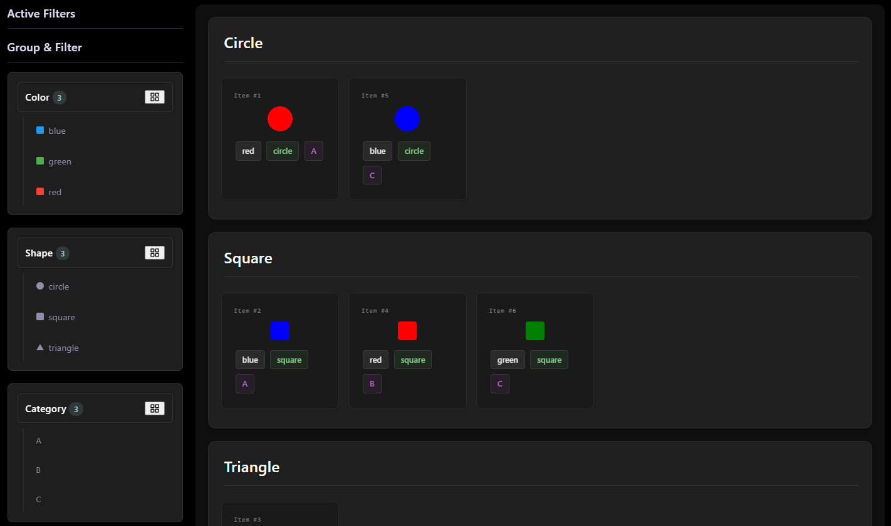

# Interactive Item Dashboard

A dynamic, htmx-powered dashboard built with Go that allows filtering and grouping of items by their properties using Protobuf for efficient data transfer.



## Features

- **Interactive Filtering**: Filter items by color, shape, or category with a single click
- **Dynamic Grouping**: Group items by any property (color, shape, or category)
- **Visual Indicators**: Color-coded items with shape representations
- **Multiple Properties**: Items have three properties:
  - Color: blue, red, green
  - Shape: square, circle, triangle  
  - Category: A, B, C
- **htmx Integration**: Lightweight, server-side rendering with minimal JavaScript
- **Responsive Design**: Clean, modern UI with smooth animations
- **Protobuf Support**: Efficient binary serialization for better performance

## How It Works

1. **Filtering**: Click on any property (color, shape, or category) to filter the items
2. **Grouping**: Use the group selector to organize items by any property
3. **Visual Feedback**: Items animate smoothly when filtered or grouped
4. **Efficient Updates**: Only the necessary HTML is updated using htmx

## Running the Application

### Prerequisites

- Go 1.19 or higher
- Protocol Buffers compiler (protoc)
- protoc-gen-go and protoc-gen-go-grpc plugins

### Installation

1. Clone the repository
2. Navigate to the project directory
3. Install dependencies:

```bash
go mod download
```

4. Generate Protobuf code:

```bash
cd proto && protoc --go_out=. --go_opt=paths=source_relative \
    --go-grpc_out=. --go-grpc_opt=paths=source_relative \
    items.proto
```

5. Run the server:

```bash
go run main.go
```

6. Open your browser to `http://localhost:8080`

## Project Structure

```
dashboard/
├── main.go                 # Main application entry point
├── pkg/
│   └── itemstore/         # Item storage and business logic
│       ├── itemstore.go   # Core item store implementation
│       └── itemstore_test.go  # Unit tests
├── proto/
│   ├── items.pb.go        # Generated Protobuf code
│   └── items.proto        # Protobuf service and message definitions
├── templates/
│   ├── index.html         # Main page template
│   └── items.html         # Item listing template with htmx
├── static/
│   └── htmx.min.js        # htmx for dynamic content updates
└── README.md
```

## Technical Details

- **Backend**: Go with standard library HTTP server
- **Frontend**: Vanilla JavaScript with htmx for dynamic updates
- **Data Format**: Protocol Buffers for efficient client-server communication
- **Templating**: Standard Go HTML templates
- **Styling**: Pure CSS with modern flexbox and grid layouts

## Testing

Run the test suite with:

```bash
go test ./...
```

## License

MIT

- **Backend**: Go with html/template for server-side rendering
- **Frontend**: htmx for dynamic interactions without full page reloads
- **Styling**: Modern CSS with gradients and transitions
- **Data**: In-memory data structure with 12 sample items

## API Endpoints

- `GET /` - Main dashboard page
- `GET /items?filterBy=color&filterValue={value}` - Get items filtered by property
- `GET /static/htmx.min.js` - htmx JavaScript library

## License

Apache License 2.0
